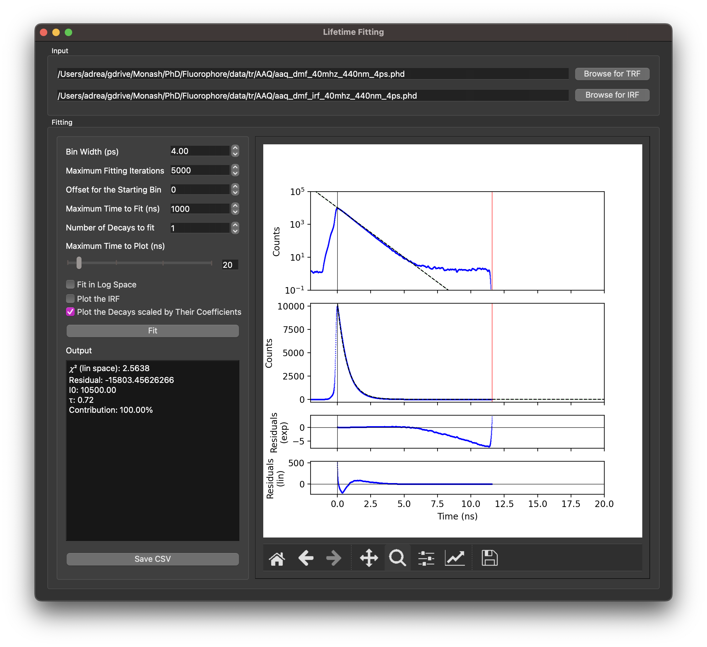

# LifetimeFittingTool
This is a quick tool I wrote to take some of my TCSPC fluorescence lifetime fitting tools from [spectraImport.ipynb](https://github.com/adreasnow/excided-state-notebooks/blob/main/spectraImport.ipynb) and make them usable for other people. It can read PicoHarp .phd files thanks to (adreasnow/picoharp-phd)[https://github.com/adreasnow/picoharp-phd] and also reads the plain `.txt` output it can save.

The app itself is a basic least squares regression tool but allows you to fit in linear or logarithmic space, supports up to 4 decays, and can export images as well as .csv files of the fitted histograms

## The Maths

Uses the form of the function:

$$
fl(t)=I_0 exp\bigg(-\frac{t}{\tau}\bigg)
$$

Where:
* $t =$ Time
* $\tau =$ Fluorescence lifetime
* $I_0 =$ Initial photon concentration

For the corrected fitting procedure, the convolved function is calculated as:

$$
\begin{gather}
fl=fl(t)_{IRF}\otimes fl(t)\\
fl_{fitted}=\sum_{i=1}^{\text{\# exponents}} C_i\cdot fl(t)_i
\end{gather}
$$

Where:
* $fl(t)_{IRF} =$ Fitted instrument response function
* $fl(t)_i =$ Fitted function for each decay
* $C_i =$ Linear coefficient for each decay

$\chi^2$ is calculated as per [fluortools](http://www.fluortools.com/software/decayfit/documentation/fit)

$$
\chi^2 = \sum_{j=1}^{n} (c_j-\hat{c_j})^2/\hat{c_j}\\
\chi^2_{red}=\frac{\chi^2}{n}
$$